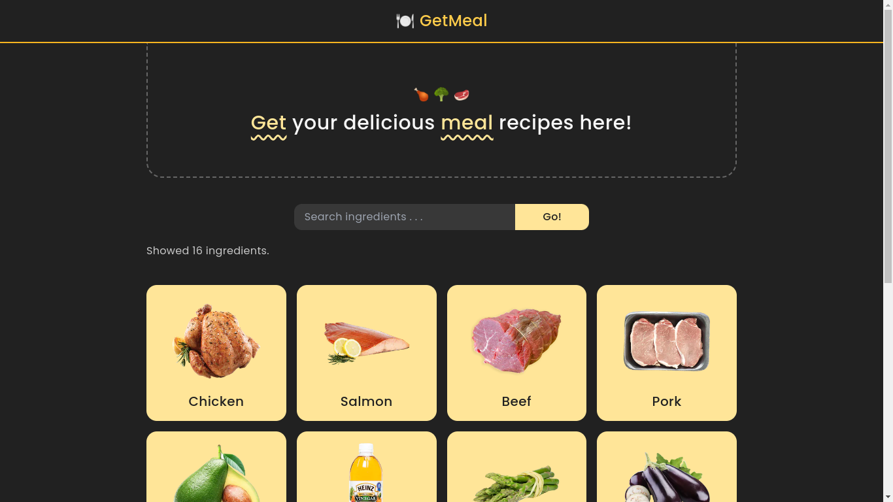

# 🍔 GetMeal

> A simple website application that shows food recipes taken from [themealdb API](https://themealdb.com).



## Tech stack

- Next.js
- TypeScript
- Tailwind CSS
- Axios
- etc

## Getting started

### Pre-requisite

- [Node.js](https://nodejs.org) v16.13+ installed on your machine.

### Installation

1. Clone this repository.

```bash
$ git clone https://github.com/up2dul/cmlabs-frontend-fulltime-test.git
```

2. Move to application directory.

```bash
$ cd cmlabs-frontend-fulltime-test
```

3. Install all dependencies.

```bash
// using pnpm
$ pnpm install

// using yarn
$ yarn install

// using npm
$ npm install
```

4. Run application.

```bash
// using pnpm
$ pnpm dev

// using yarn
$ yarn dev

// using npm
$ npm run dev
```

5. Application will be running on `http://localhost:3000`.
